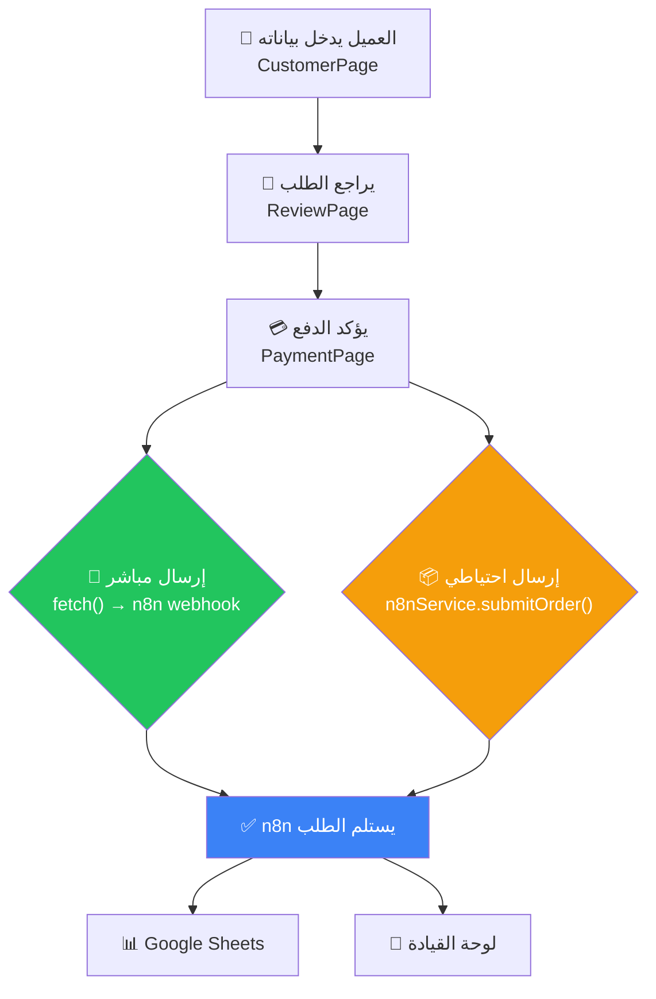

# 📦 شرح كامل لـ Payload النظام (كل البيانات المُرسلة لـ n8n)

> [!IMPORTANT]
> يوجد **نقطتين إرسال** مختلفتين في النظام، وكلاهما يرسل لنفس الـ Webhook:
> `POST https://restaurant1abukhater.app.n8n.cloud/webhook-test/submit-order`

---

## 🔴 1. PaymentPage Payload (الرئيسي والكامل)

هذا هو الـ Payload **الكامل** الذي يتم إرساله عند تأكيد الطلب من صفحة الدفع.
يحتوي على **كل** البيانات المهمة.

```json
{
  "order_id": "#15",
  "status": "pending",
  "order_type": "delivery",
  "created_at": "2026-04-01T01:30:00.000Z",
  
  "customer": {
    "name": "محمد علي",
    "phone_primary": "01012345678",
    "phone_secondary": "01144423700",
    "address": "شارع النصر - مبنى 5 - شقة 12",
    "coordinates": {
      "lat": 30.0444,
      "lon": 31.2357
    }
  },
  
  "payment": {
    "method": "instapay",
    "amount_total": 280,
    "amount_paid": 155,
    "amount_remaining": 125,
    "delivery_fee": 30,
    "screenshot": "data:image/jpeg;base64,/9j/4AAQ..."
  },
  
  "items": [
    { "name": "مشكل مشويات", "quantity": 2, "price": 100 },
    { "name": "أرز بسمتي",  "quantity": 1, "price": 50 }
  ]
}
```

### 📋 شرح كل حقل:

| الحقل | النوع | الوصف | مصدر البيانات |
|---|---|---|---|
| `order_id` | `string` | رقم الطلب التسلسلي `#1, #2, #3...` | `localStorage → order_sequence_num` |
| `status` | `string` | دائماً `"pending"` عند الإنشاء | ثابت |
| `order_type` | `string` | `"delivery"` أو `"pickup"` | `CartContext → orderType` |
| `created_at` | `string` | تاريخ ووقت الطلب بصيغة ISO | `new Date().toISOString()` |

#### 👤 Customer (بيانات العميل)

| الحقل | النوع | الوصف | مصدر البيانات |
|---|---|---|---|
| `name` | `string` | اسم العميل | `customerData.name` من صفحة CustomerPage |
| `phone_primary` | `string` | الهاتف الأساسي (11 رقم) | `customerData.phone1` |
| `phone_secondary` | `string` | الهاتف البديل (11 رقم) | `customerData.phone2` |
| `address` | `string` | العنوان التفصيلي | `customerData.address` (شارع - مبنى - شقة) |
| `coordinates` | `object\|null` | إحداثيات GPS | `location` من CartContext (عبر GPS أو الخريطة) |
| `coordinates.lat` | `number` | خط العرض | `location.lat` |
| `coordinates.lon` | `number` | خط الطول | `location.lon` |

> [!NOTE]
> **coordinates** يكون `null` في حالتين:
> - العميل اختار "مناطق ثابتة" (Fixed Areas)
> - العميل اختار "استلام من الفرع" (Pickup)

#### 💳 Payment (بيانات الدفع)

| الحقل | النوع | الوصف | مصدر البيانات |
|---|---|---|---|
| `method` | `string` | طريقة الدفع: `"instapay"` أو `"vodafone_cash"` أو `"cash"` | `paymentMethod` من CartContext |
| `amount_total` | `number` | المبلغ الإجمالي (بالجنيه) | `finalTotal` = subtotal + delivery + service |
| `amount_paid` | `number` | المبلغ المدفوع الآن | `paidNow` (في الاستلام = نصف + رسوم) |
| `amount_remaining` | `number` | المبلغ المتبقي عند التسليم | `remaining` |
| `delivery_fee` | `number` | رسوم التوصيل | `deliveryFee` من CartContext |
| `screenshot` | `string\|null` | صورة إثبات الدفع (Base64) | العميل يرفعها من صفحة الدفع |

> [!WARNING]
> **screenshot** حقل مهم جداً!
> - يكون **إلزامي** في حالة الدفع بـ InstaPay أو Vodafone Cash
> - يكون **اختياري** في حالة الدفع كاش + توصيل
> - الصورة تُرسل كـ Base64 string (قد تكون كبيرة الحجم)

#### 🍽️ Items (الأصناف)

| الحقل | النوع | الوصف |
|---|---|---|
| `name` | `string` | اسم الصنف |
| `quantity` | `number` | الكمية المطلوبة (1, 2, 3...) |
| `price` | `number` | سعر الوحدة الواحدة |

> [!TIP]
> الأصناف ترسل دائماً كـ **JSON Array** (مصفوفة) وليس كـ string.
> هذا يضمن أن n8n يستطيع قراءتها مباشرة بدون `JSON.parse` إضافي.

---

## 🟡 2. CartDrawer Payload (المختصر)

هذا يُستخدم عند الطلب السريع من داخل السلة مباشرة (بدون المرور بصفحة الدفع الكاملة).
**يحتوي بيانات أقل** من PaymentPage.

```json
{
  "order_id": "#15",
  "status": "pending",
  "customer": {
    "name": "محمد علي",
    "phone": "01012345678",
    "address": "شارع النصر"
  },
  "items": [
    { "name": "مشكل مشويات", "quantity": 2 }
  ],
  "totals": {
    "total": 250,
    "delivery_fee": 30
  },
  "created_at": "2026-04-01T01:30:00.000Z"
}
```

### ⚠️ الفرق بين PaymentPage و CartDrawer:

| البيان | PaymentPage ✅ | CartDrawer ⚠️ |
|---|---|---|
| طريقة الدفع (`payment.method`) | ✅ موجود | ❌ غير موجود |
| الاسكرين شوت (`screenshot`) | ✅ موجود | ❌ غير موجود |
| الهاتف الثاني (`phone_secondary`) | ✅ موجود | ❌ غير موجود |
| الإحداثيات (`coordinates`) | ✅ موجود | ❌ غير موجود |
| نوع الطلب (`order_type`) | ✅ موجود | ❌ غير موجود |
| سعر الصنف (`price`) | ✅ موجود | ❌ غير موجود |
| المبلغ المدفوع/المتبقي | ✅ موجود | ❌ غير موجود |

---

## 🟢 3. Legacy Payload (في api.js)

هذا هو الـ Payload القديم الذي يُرسل في الخلفية عبر `n8nService.submitOrder()`.
**لا يؤثر على الطلب الرئيسي** - هو مجرد نسخة احتياطية.

يحتوي على **كل شيء** بتفصيل أكبر (restaurant name, distance_km, estimated_time, etc.)

---

## 🔄 مسار البيانات (Data Flow)



---

## 📡 ملاحظات فنية مهمة

> [!CAUTION]
> 1. **الـ screenshot** يمكن أن يكون حجمه كبير (عدة MB كـ Base64). تأكد أن n8n يقبل payloads كبيرة.
> 2. **الـ coordinates** تكون `null` في حالة الاستلام من الفرع - لازم n8n يتعامل مع هذا.
> 3. **الـ order_id** يعتمد على `localStorage` - لو المستخدم مسح الكاش هيبدأ من #1 تاني.

